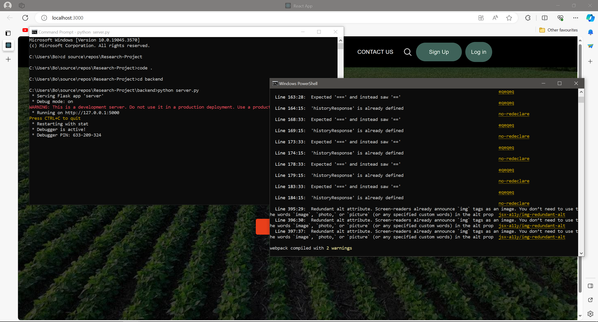

# Project 29 - Plant Disease Detection     
[](https://www.python.org/downloads/release/python-3100/) [](https://www.npmjs.org/package/npm-expansions)
## Requirements:     
The latest version of [Node.js](https://nodejs.org/en/download/) must be installed to run **`npm`**     
The following version of [Python 3.10.0](https://www.python.org/downloads/release/python-3100/) must be install to run **`python`** and **`pip`**     
The latest version of [git](https://git-scm.com/downloads) must be install to run **`git`**      

## Installation:

### 1. Clone the Repository     
```
git clone https://github.com/ANSHK310702/Research-Project.git
```    

### 2. Move to the main directory     
```
cd Research-Project
```

### 3. Application Setup
#### BackEnd Setup
1. From the main directory, move to the Backend directory:
```
cd backend
```

2. Install the Backend packages:
```
pip install -r requirements.txt
```

3. An OpenAI API Key is required for the backend. Join [here](https://platform.openai.com/) to retrieve the API Key. Use `.env.template` as a guide to add your OPENAI and change its name to `.env`.

4. Go back to the main directory:
```
cd ../
```

### Frontend Setup
1. From the main directory, move to the Frontend directory:
```
cd ui
```

2. Install the Frontend Packages:
```
npm install
```

3. Go back to the main directory:
```
cd ../
```

## Run application:
The application requires 2 Command Prompt windows running at the same time, one for running the backend machine learning server, one for running the Web Application.

### Backend Server
1. Open a Command Prompt window and go the main directory

2. From the main directory, move to the Backend directory:
```
cd backend
```

3. Run the server:
```
python server.py
```


### Frontend UI
1. Open a Command Prompt window and go the main directory

2. From the main directory, move to the Frontend directory:
```
cd ui
```

3. Run the Web Application
```
npm start
```  
  
    
### The Final running Application should look like this:

